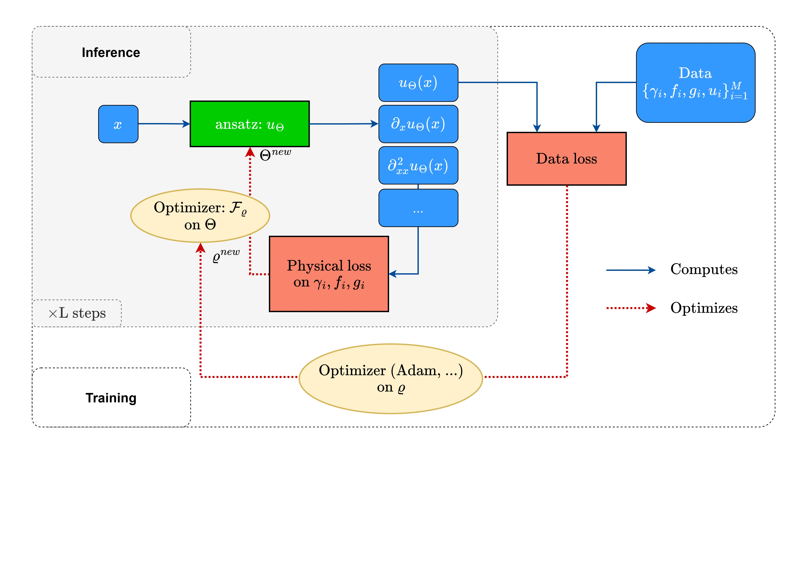

# Learning a neural solver for Parametric PDE to Enhance Physics-Informed Methods
Code for "Learning a neural solver for Parametric PDE to Enhance Physics-Informed Methods", poster at ICLR 2025. 

📋 [ICLR 2025](https://iclr.cc/virtual/2025/poster/28615)  
📑 [ArXiv](https://arxiv.org/abs/2410.06820)  
🤗 [Hugging Face](https://huggingface.co/datasets/2ailesB/neural-parametric-solver-datasets)  




## Setup
```
conda create -n neural-parametric-solver python=3.10.11
pip install -e .
```

## Code overview
The main file to train a neural solver is `main.py`. 
To train a model, 3 python objects are required: a Dataset (folder Dataset), a Model (folder models) and a Trainer (folder training). 
Each of them is instanciated with the desired config with the coresponding `init_****` functions that are available in the `init` folder. 
The default config file is `config/base.yaml`. It **purposefully** **doesn't take any input** in the network. This has to be manually added by setting the desired `input_***` parameters to True (1). See example below. 
To train a neural solver with specific new configs, you can add them in the command. For example, to use another dataset and specify the learning rate, use : 
```
python3 main.py dataset=helmholtz exp.lr=0.01 model.input_bc=1 model.input_gradtheta=1
```
The available config are summarized in the `params.txt` file. 


## How to reproduce the results of the paper? 

### Table 2: Training your neural parametric solver
- **Helmholtz**: `python3 ain.py seed=2222 data.name=helmholtz-hf data.ntrain=800 data.ntest=200 data.sub_from_x=4 model.input_gradtheta=1 model.input_bc=1 model.input_params=1 exp.wandb=1 exp.L=2 exp.inner_optimizer.name=GD model.input_idx=0 exp.inner_optimizer.lr=1 exp.optsum=0 exp.theta_init=fixed_random exp.optingd=0 exp.tags=[gd_nn] exp.batch_size=100 exp.nepoch=750`  
- **poisson**: `python3 main.py seed=2501 exp.approx.N=32 "model.nn.modes1=[16, 16, 16, 16]" exp.nepoch=750 data.name=forcingmspoisson data.ntrain=800 data.ntest=200 data.sub_from_x=1 model.input_gradtheta=1 model.input_bc=1 model.input_forcings=1 exp.wandb=1 exp.L=2 exp.inner_optimizer.name=GD model.input_idx=0 exp.tags=[gd_nn] exp.batch_size=100 exp.nepoch=750`  
- **nlrd**: `python3 main.py seed=2501 data.ntrain=800 data.ntest=200 data.name=1dnlrd data.sub_from_x=4 data.sub_from_t=4 model.input_gradtheta=1 model.input_params=1 model.input_ic=0 "model.nn.modes1=[10, 10, 10, 10]" "model.nn.modes2=[5, 5, 5, 5]" "exp.approx.N=[20, 10]" exp.batch_size=32 exp.wandb=1 exp.tags=[gd_nn] exp.scheduler.name=exp exp.L=2 exp.nepoch=750`
- **darcy-flow**: `main.py seed=2501 data.path2data=/data/lise.leboudec/datasets data.name=darcy data.sub_from_x=1 data.sub_from_y=1 model.input_gradtheta=1 model.input_params=0 "model.nn.modes1=[20, 20, 20, 20]" "model.nn.modes2=[20, 20, 20, 20]" "exp.approx.N=[40, 40]" exp.batch_size=40 exp.wandb=1 exp.tags=[gd_nn] exp.L=2 exp.nepoch=750`  
- **heat**: `python3 main.py seed=1998 data.ntrain=800 data.ntest=200 data.name=heat2d data.sub_from_x=4 data.sub_from_y=4 data.sub_from_t=4 model.input_gradtheta=1 model.input_params=1 model.input_ic=1 "model.nn.modes1=[7, 7, 7, 7]" "model.nn.modes2=[7, 7, 7, 7]" "model.nn.modes3=[5, 5, 5, 5]" "exp.approx.N=[15, 15, 10]" exp.batch_size=16 exp.wandb=1 exp.tags=[gd_nn] exp.scheduler.name=exp exp.verbose_freq=10 exp.eval_freq=100 exp.optingd=0 exp.L=2 exp.nepoch=750`  


### Figure 2: Evaluate test-time optimization on new PDEs. 
To replicate Figure 2, first train your model: 
`python3 ain.py seed=2222 data.name=helmholtz-hf data.ntrain=800 data.ntest=200 data.sub_from_x=4 model.input_gradtheta=1 model.input_bc=1 model.input_params=1 exp.wandb=1 exp.L= exp.inner_optimizer.name=GD model.input_idx=0 exp.inner_optimizer.lr=1 exp.optsum=0 exp.theta_init=fixed_random exp.optingd=0 exp.tags=[gd_nn] exp.batch_size=100 exp.nepoch=750`  

Then, simply log your trained model, take a new equation sample (eg from a test dataset) and run the neural solver. The MSE can be computed at each step using the ground truth and plotted afterwards.  

### Ablations
#### Number of steps L (figure 11)
Run $3$ training by setting exp.L= $1, 3, 5$ and then evaluate the trained models on the test set. You might need to change the inner lr and batch size according to the GPU memory consumption (more steps involve bigger memory requirements). 

#### Training with differents dataset size (figure 12)
Train several model by changing data.ntrain in $32, 64, 128, 256, 512, 1024$ and plot the MSE on the test set for each model. 

#### Optimizing with $\mathcal{L}_{PDE} (table 7)
Set exp.ld=0. 

#### Solver configutation (table 8)
Set exp.inner_optimizer.name=iterative. 

#### Inner learning rate ablation (table 9)
Train several model by changing exp.inner_optimizer.lr in $0.01, 0.1, 1$ and plot the MSE on the test set for each model. 

#### Input features (table 10)
Train several model by setting exp.input_** to 0/1 if the model has to consider the input, and plot the MSE on the test set for each model. For Table 10, we used 3 models:   
`model.input_gradtheta=0 model.input_bc=1 model.input_params=1`  
`model.input_gradtheta=1 model.input_bc=1 model.input_params=0` 
`model.input_gradtheta=1 model.input_bc=1 model.input_params=1`

#### Non linear basis (table 11)
Train your model using cfg.nl=1 to use a non linear basis. 

#### NN layer (table 12) 
Train several models by changing the model.nn.name configuration to mlp, resnet, fno or modmlp. 

#### Irregular grids (table 13)
Train models using data.sub_tr=1. 

#### Additional datasets (table 18)
You can change datasets and train models for `1dnlrd` and `advections` using: 
- **1dnlrd**: `python3 main.py seed=2501 data.ntrain=800 data.ntest=200 data.name=1dnlrdics data.sub_from_x=4 data.sub_from_t=4 model.input_gradtheta=1 model.input_params=1 model.input_ic=1 "model.nn.modes1=[20, 20, 20, 20]" "model.nn.modes2=[10, 10, 10, 10]" "exp.approx.N=[40, 20]" exp.batch_size=40 exp.wandb=1 exp.tags=[gd_nn] exp.scheduler.name=exp exp.L=2 exp.nepoch=750`
- **advections**: `python3 main.py seed=2501 data.name=advections data.sub_from_x=4 data.sub_from_t=4 model.input_gradtheta=1 model.input_params=1 model.input_ic=1 "model.nn.modes1=[20, 20, 20, 20]" "model.nn.modes2=[20, 20, 20, 20]" "exp.approx.N=[40, 40]" exp.batch_size=32 exp.wandb=1 exp.tags=[gd_nn] exp.L=2 exp.nepoch=750`

## Datasets
We succintly detail the avalaible dataset in the paper. Datasets are provided on [Hugging Face](https://huggingface.co/datasets/2ailesB/neural-parametric-solver-datasets). For more details on the PDEs and the detailed setting, we refer to section C in the appendices of [our paper](https://openreview.net/pdf?id=jqVj8vCQsT).

- `helmholtz`: solve the 1d helmholtz equation $\frac{\partial^2 u (x)}{\partial x^2} + \omega^2u(x) = 0, u(0) = u_0, \frac{\partial u(0)}{\partial x} = v_0$ with $u_0\sim \mathcal{N}(0, 1)$, $v_0 \sim \mathcal{N}(0, 1)$ and $\omega \sim \mathcal{U}(0.5, 10)$

- `poisson`:  solve the 1d Poisson equation with constant forcing term : $\frac{\partial^2 u (x)}{\partial x^2} = \alpha, u(0) = u_0, \frac{\partial u(0)}{\partial x} = v_0$, with $u_0\sim \mathcal{N}(0, 1)$, $v_0 \sim \mathcal{N}(0, 1)$ and $\alpha \sim \mathcal{U}(0.5, 10)$. 

- `helmholtz-hf`: solve the 1d helmholtz equation $\frac{\partial^2 u (x)}{\partial x^2} + \omega^2u(x) = 0, u(0) = u_0, \frac{\partial u(0)}{\partial x} = v_0$ with $u_0\sim \mathcal{N}(0, 1)$, $v_0 \sim \mathcal{N}(0, 1)$ and $\omega \sim \mathcal{U}(0.5, 50)$

- `forcingmspoisson`: solve the 1d Poisson equation with forcing term : $\frac{\partial^2 u (x)}{\partial x^2} = f(x), u(0) = u_0, \frac{\partial u(0)}{\partial x} = v_0$, with $u_0\sim \mathcal{N}(0, 1)$, $v_0 \sim \mathcal{N}(0, 1)$ and $f(x) = \frac{\pi}{K}\sum_{i=1}^{K}\alpha_i i^{2r}\sin(i\pi x), a_i \sim \mathcal{U}(-100, 100), K=16, r=-0.5$.

- `1dnlrd`: solves a non-linear Reaction-Diffusion PDE. 

$$
\begin{aligned}
    \frac{\partial u(t, x)}{\partial t} - \nu \frac{\partial^2u(t, x)}{\partial x^2} - \rho u(t, x)(1-u(t, x)) &= 0, \\
    u(0, x) &= e^{-32(x-1/2)^2}.
\end{aligned}
$$

We generate $800$ trajectories by varying $\nu$ in $[1, 5]$ and $\rho$ in $[-5, 5]$.

- `1dnlrdics`: solves a non-linear Reaction-Diffusion PDE (see above), but the initial condition also varies as:

$$
\begin{equation}
    u(x, 0) = \sum_{i=1}^3 a_i e^{-\frac{\left( \frac{x-h/4}{h}\right)^2}{4}}.
\end{equation}
$$

Where $a_i$ are randomly chosen in $[0, 1]$ and $h=1$ is the spatial resolution. 

- `advection`: Take one dataset with fixed advection parameter from PDEBench [1]. We refer to PDEBench for more deatils. The PDE expresses as: 

$$
\begin{aligned}
    \frac{\partial u(t, x)}{\partial t} + \beta \frac{\partial u(t, x)}{\partial x} &= 0, \hspace{3mm} x\in (0, 1), t\in (0, 2], \\
    u(0, x) &= u_0(x), \hspace{3mm} x\in (0, 1).
\end{aligned}
$$

- `advections`: Adapted from PDEBench [1]: mix trajectories with several PDE parameters ($\beta$ varying between $0.2$ and $4$). 

- `darcy`: The Darcy dataset is talen from [2]. As for the `advection` dataset, we refer to the FNO paper for more details on the dataset. The PDE expresses as: 

$$
\begin{aligned}
    -\nabla.(a(x)\nabla u(x)) &= f(x) \hspace{3mm} x \in (0, 1)^2,\\
    u(x) &= 0 \hspace{3mm} x \in \partial(0, 1)^2.
\end{aligned}
$$

- `heat2d`: This dataset is inspired from [3]. The PDE expresses as: 

$$
\begin{aligned}
    \frac{\partial u (x, y, t)}{\partial t} - \nu \nabla^2 u(x, y, t) &= 0,\\
    u(x, y, 0) &= \sum_{j=1}^J A_j\sin(\frac{2\pi l_{xj}x}{L} + \frac{2\pi l_{yj}y}{L} + \phi_i).
\end{aligned}
$$


## Models

- `gd_nn`: non linear preconditioning of the gradient : $\theta_{k+1} = \theta_k - \eta P_{\theta}(\nabla \mathcal{L}(\theta), ...)$

## Training

- `nd`: General training training procedure for our model.


### References

[1] PDEBENCH: An Extensive Benchmark for Scientific Machine Learning, Makoto Takamoto, Timothy Praditia, Raphael Leiteritz, Dan MacKinlay, Francesco Alesiani, Dirk Pflüger, Mathias Niepert, NeurIPS 2022 - Track on Datasets and Benchmarks.

[2] Fourier Neural Operator for Parametric Partial Differential Equations, Zongyi Li, Nikola Kovachki, Kamyar Azizzadenesheli, Burigede Liu, Kaushik Bhattacharya, Andrew Stuart, Anima Anandkumar, ICLR 2021. 

[3] Masked Autoencoders are PDE Learners, Anthony Zhou, Amir Barati Farimani, TMLR 20224. 